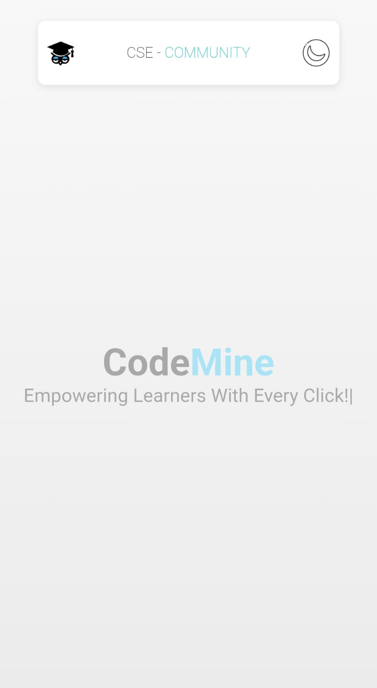
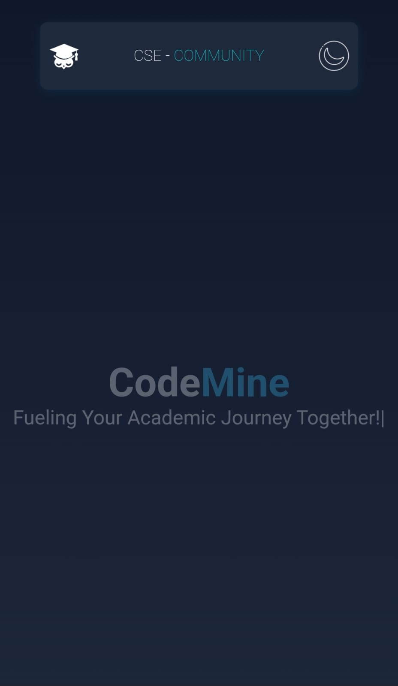
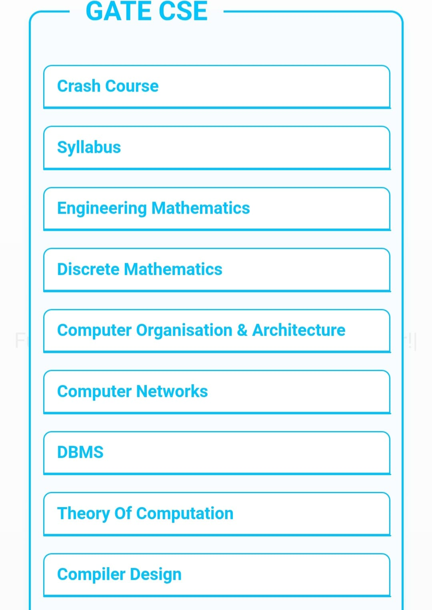

# 🚀 CodeMine – Free Resource Hub for Computer Science Students

CodeMine is your **all-in-one platform** for accessing **high-quality, free resources** designed specifically for Computer Science students. Whether you're preparing for **placements**, **GATE CSE**, **college exams**, or looking for **project inspiration**, CodeMine brings everything together — so you don’t have to search across the internet.

---

## 🎯 Vision

> "Our vision is to become the one-stop hub for every computer science student seeking free, high-quality resources for placements and academics."

We believe **no student should have to waste time** scouring the web for reliable study materials. CodeMine offers a centralized space for:

- 📚 **Book PDFs & Handwritten Notes**
- 🧠 **Placement Prep Materials** (DSA, HR questions, Aptitude)
- 📌 **Quick-access Cheat Sheets**
- 🎯 **GATE CSE Resources & PYQs**
- 🔍 **Top GitHub Profiles for Inspiration**
- 🛠️ **Project Ideas & Tools**
- 🎥 **Curated Video Playlists (YouTube, NPTEL, etc.)**

---

## 🌐 Access Anytime, Anywhere

> Resources on CodeMine are free, organized, and always accessible — no signup, no searching.

---

## 📸 Sneak Peek

 

 

> ✨ UI preview of the CodeMine interface — lightweight, mobile-friendly, and fast.

---

## 🙌 Contributing

Have a great GitHub repo, cheat sheet, or handwritten notes to share? We welcome contributions from the community! Just open a pull request or issue to get started.

---

## 📩 Stay Connected

Want to collaborate or suggest features?  
📧 Email us at: [codeminestartup@gmail.com]

---

## 🧡 Powered by the Community. Built for Students.
